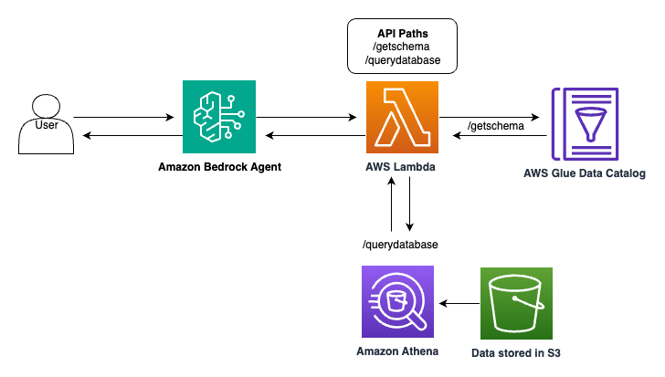

<h1 align="center">Text to SQL Bedrock Agent</h1>


## Authors ( by Korean) :
**Yeonkyung Park** @yeonkp

## Introduction
자연어 처리를 활용한 "Text to SQL Bedrock Agent"는 자연어 질문을 실행 가능한 SQL 쿼리로 자동 변환하는 것을 용이하게 합니다. 
이 도구는 복잡한 데이터베이스 구조와 직관적인 인간 질문 간의 격차를 메우며, 사용자는 간단한 영어 프롬프트를 사용하여 데이터에서 쉽게 통찰력을 추출할 수 있습니다. 
AWS Bedrock의 에이전트 기술을 활용하고 
AWS의 강력한 인프라와 AWS Bedrock에서 제공하는 LLM간의 시너지를 보여주며, 정교한 데이터 분석을 더 많은 사람이 이용할 수 있도록 합니다.
이 repository에는 AWS 서비스와 함께 Bedrock Agent를 사용하여 Text to SQL 변환을 설정하고 테스트하는 데 필요한 파일이 포함되어 있습니다.



## 테스트 데이터셋

Glue 크롤러를 통해 Glue의 데이터베이스로 5개의 테이블을 구성합니다. 
야구 역사 관련 테이블 및 데이터셋을 활용합니다.

**hall_of_fame 테이블**:
MLB 명예의 전당 투표 결과를 종합적으로 기록하는 마스터 테이블, 
1936년부터 2016년까지의 명예의 전당 투표 기록, 선수, 감독, 공헌자 등 다양한 category 포함, 투표율과 당선 여부 추적 가능
```
- player_id: 선수 고유 ID (Primary Key)
- yearid: 명예의 전당 투표 년도 
- votedby: 투표 주체 (BBWAA, Veterans 등)
- ballots: 전체 투표 수
- needed: 당선에 필요한 최소 득표 수
- votes: 획득한 득표 수
- inducted: 명예의 전당 입성 여부 (Y/N)
- category: 범주 (Player, Manager, Pioneer/Executive 등)
```

**player 테이블**:
MLB 선수들의 기본 신상정보 포함, 선수의 다양한 이름 정보(성, 이름, 법적 이름) 보유
```
- player_id : 선수 고유 ID
- birth_year : 출생년도
- birth_month : 출생월
- birth_day : 출생일
- birth_country : 출생국가
- birth_state : 출생주
- birth_city : 출생도시
- name_first : 이름
- name_last : 성 
- weight : 체중 
```

**player_award 테이블**:
이 데이터는 선수(player) 테이블과 연관된 19세기 MLB의 트리플 크라운 수상 기록을 보여주고 있습니다.
각 수상자의 상세 정보(출생지, 신체정보 등)는 player 테이블에서 player_id를 통해 조회 가능

```
- player_id: player 테이블의 선수 ID와 연결되는 외래키
- award_id: 'Triple Crown'과 'Pitching Triple Crown' 두 종류
- year: 수상 연도
- league_id: NL(National League)과 AA(American Association) 두 리그
- tie: 공동수상 여부 
- notes: 특이사항
```

**player_award_vote 테이블**:
투표 결과를 담고 있는 테이블입니다. 1956년부터 1959년까지의 사이영상 투표 결과
player 테이블과 연계하여 수상 후보들의 세부 정보 확인 가능

```
- award_id: 상의 종류 
- year: 수상 연도
- league_id: 리그 ID (ML: Major League)
- player_id: 선수 고유 ID (player 테이블과 연결되는 외래키)
- points_won: 획득한 투표 점수
- points_max: 최대 가능 투표 점수
- votes_first: 1위표 획득 수
```

**salary 테이블**:
MLB 선수들의 연봉 정보를 담고 있는 테이블입니다. 1985년 Atlanta Braves 팀의 선수 연봉 데이터를 포함 
특정 연도의 팀별 연봉 총액 계산 가능, 선수별 연봉 추이 분석 가능, 리그별, 팀별 연봉 수준 비교 가능

```
- year: 연봉 수령 연도
- team_id: 소속 팀 ID (예: ATL은 Atlanta Braves)
- league_id: 소속 리그 ID (NL: National League)
- player_id: 선수 고유 ID (player 테이블과 연결되는 외래키)
- salary: 연봉 (USD)
```

## Use case
여기의 코드는 자연어 질문에서 SQL 쿼리를 작성할 수 있는 에이전트를 설정합니다. 
그런 다음 데이터베이스에서 응답을 검색하여 사용자 문의에 정확한 답변을 제공합니다. 
아래 다이어그램은 이 솔루션의 아키텍처를 간략하게 설명합니다.

에이전트는 다음을 위해 설계되었습니다.
- Retrieve database schemas
- Execute SQL queries

## 람다 함수의 역할

lambda_function.py 이 Lambda 함수는 AWS Glue와 Athena를 활용하여 야구 데이터베이스를 조회하는 두 가지 주요 기능을 제공합니다:

1. `/getschema` 경로: Glue 클라이언트를 사용하여 'thehistoryofbaseball' 데이터베이스의 모든 테이블 스키마를 조회

2. `/querydatabase` 경로: Athena 클라이언트를 통해 사용자가 요청한 SQL 쿼리를 실행하고 결과를 반환

함수는 입력된 event의 apiPath에 따라 적절한 작업을 수행하고, 결과를 JSON 형식으로 포맷팅하여 반환합니다. 오류 처리와 쿼리 실행 상태 모니터링도 포함되어 있습니다.

## dependencies 설명

**1. config.py**

이 코드는 AWS 서비스를 사용하기 위한 초기 설정과 변수 정의를 담당합니다.
이 설정들은 텍스트를 SQL로 변환하는 Bedrock 에이전트 생성과 관련된 AWS 리소스들을 관리하기 위한 기본 구성을 제공합니다.
1-1. 필요한 AWS 서비스(Bedrock, Lambda, S3, Glue, Athena 등)의 클라이언트 초기화
1-2. 현재 AWS 리전과 계정 ID를 가져와서 리소스 이름에 사용할 suffix 생성
1-3. 에이전트, 버킷, 정책, 역할, 람다 함수 등의 리소스 이름 정의
1-4. 데이터베이스, 크롤러, 파일 경로 등 Glue와 관련된 설정 정의
1-5. 로깅 설정과 기본 경로 설정

**2. build_infrastructure.py**

이 코드는 AWS Bedrock Agent를 설정하고 배포하는 전체 프로세스를 구현합니다.
자연어로 SQL 쿼리를 생성하고 실행할 수 있는 완전한 Bedrock Agent가 구성됩니다.

2-1. S3 버킷 생성 및 API 스키마 업로드
2-2. Glue 데이터베이스와 크롤러 생성, 데이터 업로드 및 크롤링 실행
2-3. Lambda 함수 생성 (SQL 쿼리 실행용)을 위한 IAM 역할과 정책 설정
2-4. Bedrock Agent를 위한 IAM 정책과 역할 생성
2-5. Bedrock Agent 생성 (SQL 쿼리 지원을 위한 설정 포함)
2-6. Agent Action Group 생성 및 Lambda 함수와 연결
2-7. Lambda 함수에 Bedrock 호출 권한 부여
2-8. Agent 준비(prepare) 및 별칭(alias) 생성

**3. text_to_sql_openapi_schema.json**
이 OpenAPI 스키마 문서는 데이터베이스 조회를 위한 두 가지 API 엔드포인트를 정의하고 있습니다:
이 스키마는 API의 요청/응답 구조, 데이터 타입, 필수 필드 등을 명확히 정의하여 API 사용자들이 쉽게 이해하고 활용할 수 있도록 합니다.

3-1. `/getschema` (GET):
- 데이터베이스의 모든 테이블과 스키마 정보를 조회
- 각 테이블의 이름과 컬럼 구조를 반환
- 200 응답으로 JSON 배열 형태의 테이블 정보 제공

3-2. `/querydatabase` (POST):
- SQL 쿼리를 실행하여 데이터베이스에서 정보를 검색
- 요청 본문에 SQL 쿼리문 필요
- 성공 시 200 응답으로 쿼리 결과 반환, 실패 시 400 에러
- 한 번에 하나의 SQL 쿼리만 처리 가능


## 필수 조건

시작하기 전에 다음이 있는지 확인하세요.
- 다음 권한이 있는 AWS 계정:
- IAM 역할 및 정책을 만들고 관리합니다.
- AWS Lambda 함수를 만들고 호출합니다.
- Amazon S3 버킷을 만들고, 읽고, 씁니다.
- Amazon Bedrock 에이전트 및 모델에 액세스하고 관리합니다.
- Amazon Glue 데이터베이스 및 크롤러를 만들고 관리합니다.
- Amazon Athena에서 쿼리를 실행하고 작업 공간을 관리합니다.
- Amazon Bedrock 기반 모델에 액세스합니다(이 솔루션의 경우 Anthropic의 Claude 3 Sonnet 모델)

- 로컬 설정의 경우, 
- Python 및 Jupyter Notebook 설치
- AWS CLI 설치 및 구성
- AWS SageMaker의 경우 
- 도메인에 위의 권한이 있는지 확인합니다.
- SageMaker Studio에서 Data Science 3.0 커널 사용

## 설치 
로컬 머신이나 AWS 환경에 repository를 복제합니다.
git clone https://github.com/psps97/text-2-sql-agent.git

## 사용법 (절차)

1. `create_and_invoke_sql_agent.ipynb` Jupyter Notebook을 열어 시작합니다.
2. 노트북 셀을 순서대로 실행합니다. 노트북은 다음을 수행합니다.
- `config.py`에서 구성을 가져옵니다.
- 고유한 `AWS_PROFILE'을 설정합니다.
- `build_infrastructure.py`를 사용하여 필요한 인프라를 빌드합니다. 여기에는 다음이 포함됩니다.
- S3 버킷
- Lambda 함수
- Bedrock 에이전트
- Glue 데이터베이스 및 크롤러
- 필요한 IAM 역할 및 정책
3. 인프라가 설정되면 노트북 내에서 샘플 쿼리를 실행하여 에이전트를 테스트할 수 있습니다.
4. 생성된 모든 리소스를 삭제하고 지속적인 요금을 피하려면 노트북에서 clean.py 스크립트를 실행합니다.

